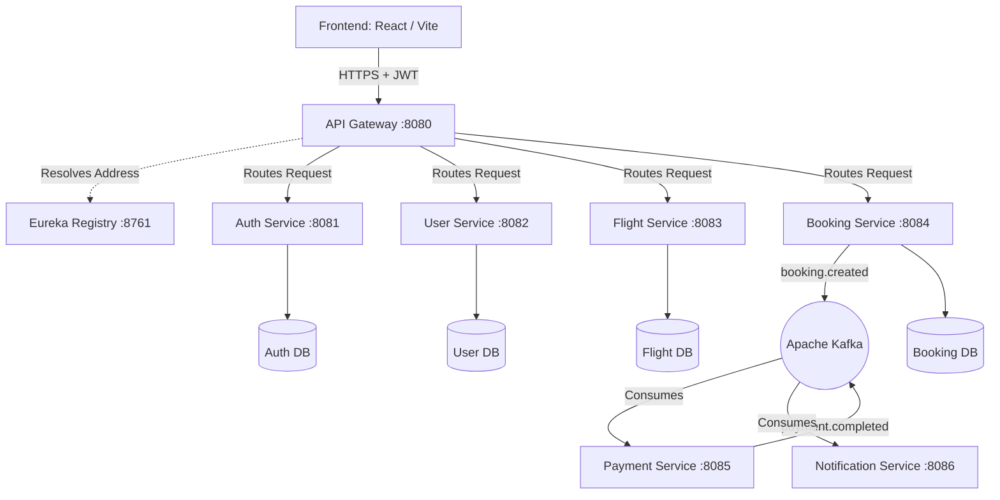

<div align="center">
  

  # ✈️ SkyLink

  **Next-Generation Airline Reservation Platform**

  [](https://reactjs.org/)
  [](https://spring.io/projects/spring-boot)
  [](https://kafka.apache.org/)
  [](https://tailwindcss.com/)
  [](https://microservices.io/)

  <p align="center">
    A highly scalable, event-driven airline booking system built with Java Spring Boot Microservices and a stunning React frontend.
  </p>
</div>

---

## ✨ Outstanding Features

### 🎨 Frontend (React + Vite)
- **Interactive Seat Map:** A visually stunning, click-to-select airplane cabin grid that dynamically calculates fares based on real-time availability.
- **Digital Boarding Passes:** Generates beautiful airline-style boarding passes for confirmed bookings with dynamic QR codes, terminals, and gate times.
- **SkyMiles Loyalty Program:** An automated tier-based rewards system (Blue, Silver, Gold, Platinum) with animated UI cards tracking user spending.
- **High-Performance Search:** Client-side sorting and filtering (by price, airlines, and time) optimized using React `useMemo` for instant, lag-free UI updates.
- **Admin Dashboard:** Features real-time revenue charts (Framer Motion) and recent booking activity feeds.

### ⚙️ Backend (Spring Boot Microservices)
- **API Gateway & Service Discovery:** Utilizes **Spring Cloud Gateway** for centralized routing and **Netflix Eureka** for dynamic service registry and load balancing (`lb://`).
- **Event-Driven Choreography:** Leverages **Apache Kafka** to decouple core services. Booking creation asynchronously triggers Payment processing and Email Notifications.
- **Stateless Security:** Secured via **Spring Security** and **JWT (JSON Web Tokens)**. Passwords are cryptographically hashed using **BCrypt**.
- **Data Integrity:** Utilizes Spring Data JPA with `@Transactional` management to handle concurrent booking race conditions gracefully.

---

## 🏗️ System Architecture

SkyLink implements a pure Microservices pattern combined with Event-Driven processing for high availability.



---

## 📁 Project Structure

```text
SkyLink/
├── frontend/                  # React, Vite, Tailwind CSS, TypeScript
│   ├── src/pages/             # UI Views (Flight Details, Dashboard, Profile)
│   ├── src/components/        # Reusable UI (Cards, Modals, Loaders)
│   └── src/api/               # Axios API Services connecting to Gateway
│
└── backend/                   # Spring Boot Microservices
    ├── api-gateway/           # Spring Cloud Gateway (Global CORS, Routing)
    ├── eureka-server/         # Netflix Eureka Service Discovery
    ├── auth-service/          # JWT Generation, BCrypt Hashing
    ├── flight-service/        # Flight Schedules, JPA Queries, Pagination
    ├── booking-service/       # @Transactional seat locking, Kafka Producer
    ├── payment-service/       # Kafka Consumer & Producer
    └── notification-service/  # Kafka Consumer (Emails/SMS)
```

---

## 🛠️ Tech Stack

| Domain | Technologies Used |
| :--- | :--- |
| **Frontend** | React 19, TypeScript, Vite, Tailwind CSS, Framer Motion, Lucide Icons |
| **Backend** | Java 17, Spring Boot 3.2, Spring Cloud (Gateway, Eureka) |
| **Messaging** | Apache Kafka, Zookeeper |
| **Database** | MySQL / PostgreSQL, Spring Data JPA |
| **Security** | JWT (JSON Web Tokens), Spring Security, BCrypt |

---

## 🚀 Getting Started

### Prerequisites
- Java JDK 17+
- Node.js v18+ *(Required for frontend build tools/npm)*
- Apache Kafka & Zookeeper *(Running on default ports)*
- Maven

### 1. Boot up the Backend
Ensure your database is running, then start the microservices in your IDE or via maven in the following order:
1. `eureka-server` *(Wait for it to start completely)*
2. `api-gateway`
3. `auth-service`, `flight-service`, `booking-service`
4. `payment-service`, `notification-service`

### 2. Start the Frontend
```bash
cd frontend
npm install
npm run dev
```
The application will launch at `http://localhost:5173`. All backend API calls are automatically proxied to the API Gateway running on port `8080`.

---

## 🛡️ Best Practices Implemented
- **Global CORS:** Handled strictly at the Gateway level to ensure internal microservices aren't exposed directly.
- **Fail-Fast Event Driven:** Using Kafka ensures that if the Notification service goes down, Bookings still succeed and messages are processed when the service recovers.
- **Optimized UI Rendering:** Heavy UI filtering operations utilize React's `useMemo` hook to prevent unnecessary DOM repaints.

<br/>
<p align="center">Made with ❤️ for modern software engineering.</p>